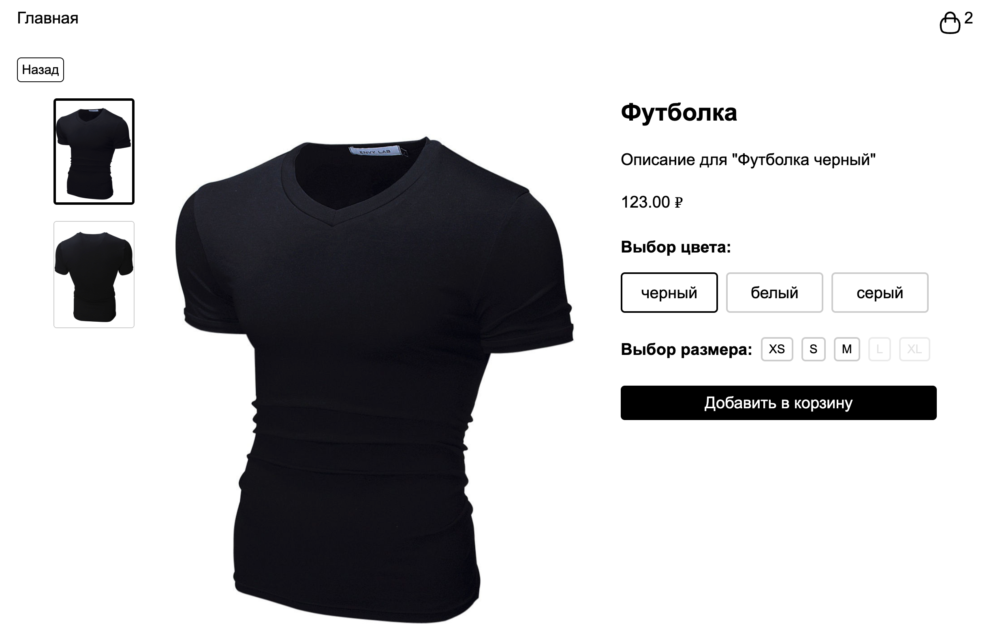

### Деплой проекта

https://lkhusnullina.github.io/react-test-task-middle/

#### Запуск проекта

#### Скачайте архив проекта или склонируйте репозиторий

```sh
git@github.com:lkhusnullina/react-test-task-middle.git
```

#### Установите зависимости проекта

```sh
npm install
```
#### Запустите проект командой

```sh
npm run start
```
# Задача:

Используя ReactJS сделать три страницы каталога товаров:

1. Список товаров;
2. Детальная страница товара;
3. Корзина;

Реализация функционала страниц произвольная (сторонние библиотеки, либо просто на компонентах).

Данные о товарах нужно получать из `fake-api`, которое находится тут - `src/services/api.js`.

На странице со списком должны быть товары с картинками. По клику на товар - переход на карточку товара.

На детальной странице нужно:
* Вывести информацию по товару;
* Реализовать выбор `цвета`;
* Просмотр изображений через переключение без использования сторонних библиотек;
* Выбор размера из списка доступных, не доступные размеры должны быть заблокированы;

Реализовать корзину в упрощённом виде:
* Добавление товара с цветом и размером корзину. Добавлять нужно в единичном виде: связки `товар-цвет-размер`. Не нужно делать количество добавленных экземпляров. Но товары должны быть уникальные;
* Вывод количества добавленных товаров в кнопку перехода на страницу корзины;
* Отдельную страницу корзины со списком добавленных товаров. Не обязательно стилизовать эту страницу, можно сделать аналогично странице списка товаров, с дополнительной информацией о добавленном товаре(смотри `example`);
* Удаление товара на странице корзины;

Кнопка перехода в корзину должна быть на каждой странице. Для хранения добавленных товаров можно использовать что угодно.